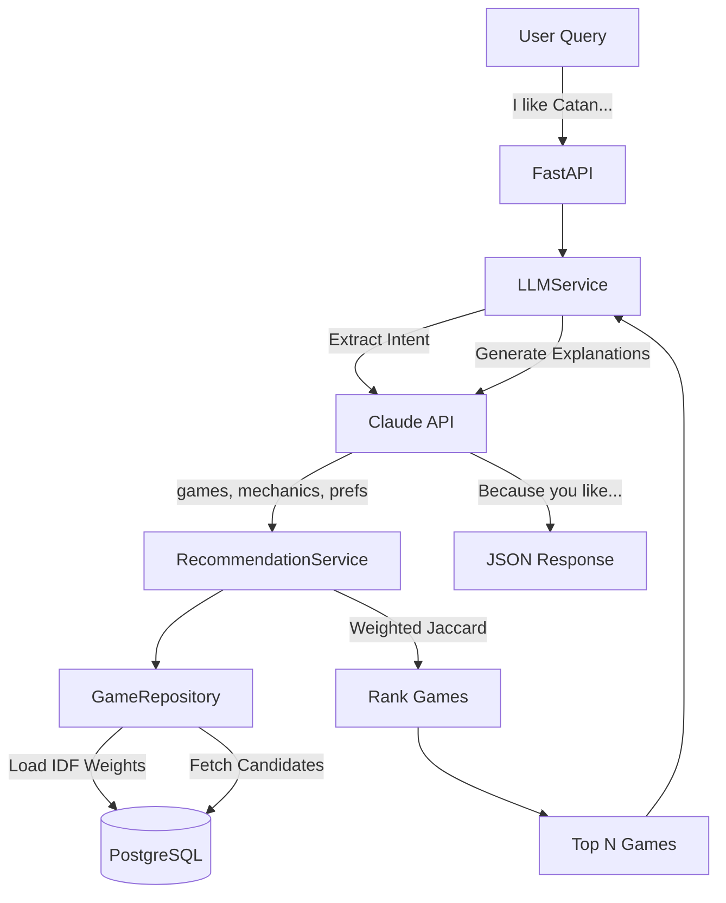

# BoardFlow Project Overview

**LLM-powered board game recommendation engine** using natural language queries, content-based filtering, and BGG data.

---

**Core Features:**
- ✅ Boardgamegeek application data ingestion (metadata, stats, rankings)
- ✅ Natural language query parsing (Claude API)
- ✅ Content-based recommendation algorithm with IDF weighting
- ✅ FastAPI REST API
- ✅ Async PostgreSQL with partitioned time-series tables

---

## Quick Start

1. **Setup** - Configure environment variables and start database
2. **Ingest Data** - Fetch board game metadata from BGG (two modes: random sampling or top-ranked)
3. **Compute IDF Weights** - Calculate importance weights for mechanics and categories
4. **Test** - Verify API recommendations are working

See [README.md](README.md) for detailed commands and configuration.

---

## Architecture

### Data Flow

1. **Query Extraction** → Claude parses NL query into structured intent
2. **Profile Building** → Aggregate mechanics/categories from user's liked games
3. **Load IDF Weights** → Fetch precomputed weights (rare mechanics boosted)
4. **Candidate Retrieval** → Fetch all games (minimal filters)
5. **Ranking** → Score using weighted Jaccard + preferences + quality + exploration
6. **Explanation** → Claude generates human-readable reasoning

---

## Key Components

| Component | Purpose | Location |
|-----------|---------|----------|
| **Data Ingestion** | BGG XML API → Postgres | `ingestion/` |
| **IDF Service** | Compute TF-IDF weights | `services/idf_service.py` |
| **Recommendation Service** | Orchestrate ranking logic | `services/recommendation_service.py` |
| **LLM Service** | Claude API (extraction + explanations) | `services/llm_service.py` |
| **Game Repository** | Database access layer | `repositories/game_repository.py` |
| **FastAPI** | REST API endpoints | `api/` |
| **Database** | PostgreSQL + partitioned tables | `db/` |

---

## Database Schema

**Core Tables:**
- `bgg.games` - Game metadata (name, year, designer)
- `bgg.game_names` - Alternate names for fuzzy matching
- `bgg.mechanics` / `bgg.categories` - Lookup tables
- `bgg.game_mechanics` / `bgg.game_categories` - Junction tables (many-to-many)

**Time-Series Tables (Partitioned):**
- `bgg.game_stats` - Ratings, complexity, ownership counts
- `bgg.game_ranks` - BGG rankings over time

**IDF Weighting Tables:**
- `bgg.mechanic_stats` - Precomputed IDF weights for mechanics
- `bgg.category_stats` - Precomputed IDF weights for categories

**PostgreSQL Extensions:** `pg_trgm` (fuzzy text matching)

---

## Recommendation Algorithm

### Scoring Formula

**Total Score** (0-1 scale) combines four components:
- **Profile Similarity (30%)** - Weighted Jaccard using IDF weights. Rare mechanics (e.g., "Passed Action Token") score 3.6× higher than common ones (e.g., "Dice Rolling")
- **Preference Alignment (35%)** - Player count and complexity proximity
- **Quality Baseline (25%)** - BGG Bayesian average rating
- **Exploration Boost (10%)** - Anti-echo-chamber factor to diversify recommendations

### IDF Weighting Impact

Rare mechanic matches contribute **3.6× more** than common ones (e.g., IDF 7.99 vs 1.43), leading to more distinctive recommendations instead of generic popular games.

---

## Scripts

**Available Scripts:**
- **run_ingestion.py** - Fetches BGG data incrementally (supports random or ranked sampling)
- **compute_idf_weights.py** - Calculates importance weights for mechanics/categories
- **verify_idf_implementation.py** - Tests IDF weighting correctness
- **test_api.py** - End-to-end API recommendation testing

**Workflow:** Ingest data → Compute IDF weights → Test API

See [README.md](README.md) for command syntax.

---

## Migrations

Database schema managed via Alembic. Latest migration adds mechanic_stats and category_stats tables for IDF weighting.

Commands in [README.md](README.md).

---

## Testing

**API Testing:** Start FastAPI server, run test_api.py to verify recommendations work end-to-end.

**Expected Results:**
- IDF weights loaded for 173 mechanics, 84 categories
- Weighted Jaccard correctly boosts rare mechanics (0.4588 vs 0.1257)
- Fallback mode works when IDF disabled (equal weights)

Commands in [README.md](README.md).

---

## Recent Changes

### March 6, 2026: Guaranteed LIMIT via Set-Difference Ingestion

**Problem:** Previous ingestion wasted API calls on duplicate games, couldn't guarantee exact LIMIT.

**Solution:** Set-difference algorithm loads all CSV IDs and DB IDs, computes difference, then samples exactly LIMIT new games.

**Modes:**
- **Random (default)** - Better diversity across the catalog
- **Ranked (--ranked)** - Top-ranked NEW games only (not overall rankings)

**Algorithm:**
1. Load all 30K ranked game IDs from CSV (filters out 144K unranked)
2. Load all existing game IDs from DB
3. Compute set difference (CSV - DB)
4. Sample LIMIT games from difference (random or sorted by rank)
5. Ingest via concurrent workers

**Result:** Guarantees exactly LIMIT new games, or all remaining if fewer available.

### March 6, 2026: TF-IDF Normalization

**Problem:** Common mechanics (dice rolling, hand management) dominated similarity scores, leading to generic recommendations.

**Solution:** Implemented IDF (Inverse Document Frequency) weighting where rare mechanics get ~8.0 weight, common ones ~1.4 weight. Replaced binary Jaccard with weighted Jaccard.

**Impact:**
- Rare mechanic matches contribute more to score
- More distinctive, personalized recommendations
- Backward compatible (falls back to equal weights if disabled)
---

## Contact

**Project:** BoardFlow - Board Game Recommendation Engine
**Developer:** Derin Ben Roberts
**Last Updated:** March 10, 2026
